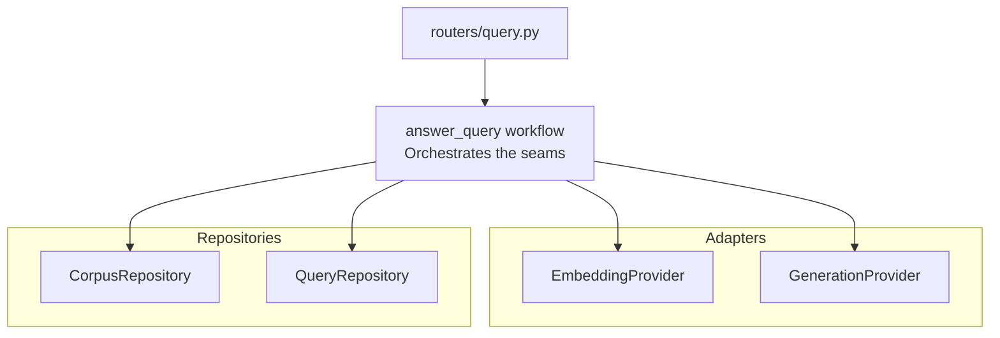

# Codebase Design

This note applies the `sdlc-architecture-codebase-design` skill to the Advisor API as built for Vertical Slices 0001 and 0002. It follows the same design vocabulary as HiveSight's own `codebase-design.md`, since the underlying discipline is the same even though the two codebases are architecturally independent.

## Design Vocabulary

- **Module**: anything with an interface and implementation, from a function to a service package.
- **Interface**: everything a caller must know to use a module correctly, including invariants and errors.
- **Seam**: the place where behaviour can vary without editing the caller.
- **Adapter**: a concrete implementation at a seam, such as a repository, embedding provider, or generation provider.
- **Depth**: how much useful behaviour sits behind a small interface.

## Diagram

## Modules

### `routers/query.py` — thin route handler

`POST /queries` resolves the dev-authenticated user, checks Workspace Membership via `QueryRepository`, then delegates everything else to `AnswerQueryWorkflow`. It holds no business logic itself — matching `sdlc-delivery-python-service-style`'s convention of keeping route handlers thin and pushing behaviour into a workflow module.

### `workflows/answer_query.py` — the deep module

`AnswerQueryWorkflow.answer_query` is where the actual seam work happens: embed the Query, retrieve the closest Passage scoped to the resolved Jurisdiction, generate an Answer grounded in it, derive `grounding_status` from whether any Citations came back, then persist. Callers only ever call one method; everything about how retrieval, generation, and persistence compose is hidden behind it. This module has four collaborators, each injected rather than constructed internally, so each can be swapped independently in tests:

- `CorpusRepository` — Passage retrieval
- `EmbeddingProvider` — turns Query text into a vector
- `GenerationProvider` — turns retrieved Passages into Answer text plus Citations
- `QueryRepository` — persistence

### Adapters — `EmbeddingProvider` and `GenerationProvider`

Both seams earn a `Protocol` because both already have two real adapters, per `sdlc-delivery-dependency-injection`'s two-adapter rule:

- `EmbeddingProvider`: `StubEmbeddingProvider` (deterministic hash-based vector, used whenever `VOYAGE_API_KEY` is unset — the default test suite) and `VoyageEmbeddingProvider` (real Voyage AI call).
- `GenerationProvider`: `StubGenerationProvider` (deterministic templated text, used whenever `ANTHROPIC_API_KEY` is unset) and `ClaudeGenerationProvider` (real Claude call, using `output_config.format` for structured citation extraction rather than parsing free text).

`dependencies.py` chooses the real adapter over the stub whenever the corresponding API key is present, and falls back to the stub otherwise — so the default automated test suite, and any environment without keys configured, never makes a live call.

### Repositories — `CorpusRepository` and `QueryRepository`

`CorpusRepository.find_similar_passages` is the pgvector similarity search, scoped by `jurisdiction_id` in its `WHERE` clause — this is what makes cross-jurisdiction blending structurally impossible, not a separate guard elsewhere. `QueryRepository` persists the Query, Answer, and Citations, and answers the Workspace Membership check the router relies on before it calls the workflow at all. Neither has a stub adapter — both are tested directly against a real Postgres/pgvector test database, per `sdlc-delivery-python-service-style`'s testing guidance for local-substitutable stores.

## Closeout

If a future slice adds a new seam (source supersession, corrections, the no-grounding path), update this document with the new module and where it sits relative to `answer_query workflow` — don't let the diagram drift from what dependency injection actually wires up in `dependencies.py`.
