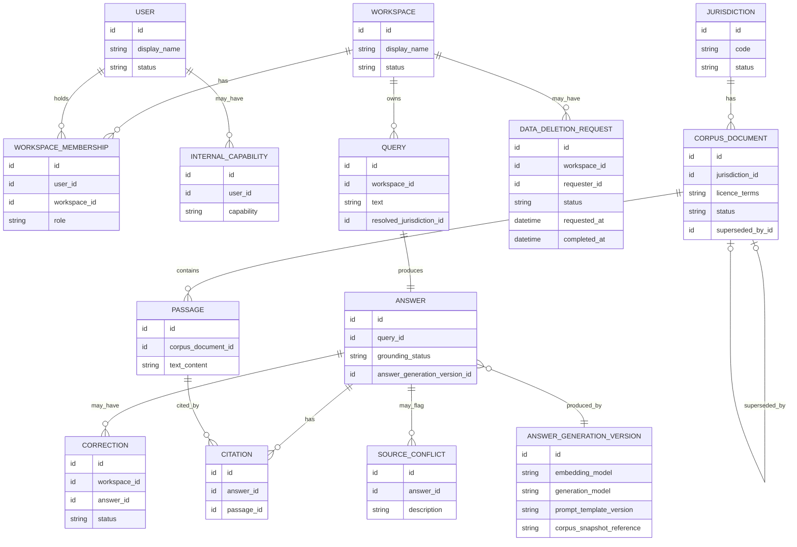

# Domain Model Diagram

Visual companion to `architecture/domain-model.md`. Kept conceptual — attributes are limited to what orients the reader, not a full schema.

## Core Product And Governance Model

## Reading Notes

- `CORPUS_DOCUMENT |o--o| CORPUS_DOCUMENT : superseded_by` is a self-reference: a document may point to the one document that superseded it. Optional on both sides because most documents are never superseded, and a document cannot supersede itself.
- `QUERY ||--|| ANSWER` is one-to-one for v1: one Query produces exactly one Answer. Follow-up questions are new Queries, not a thread, until conversational history is deliberately designed (see the domain model's Open Architecture Questions).
- `CORRECTION` and `SOURCE_CONFLICT` both hang off `ANSWER`, not off `QUERY` or `CITATION` — a correction is about whether the answer was right; a conflict is about whether the sources agreed. Keeping them separate keeps each one asking a single question.
- `ANSWER_GENERATION_VERSION` is deliberately not shaped like HiveSight's `Model Version` — there is no training/benchmark lifecycle behind it in v1, just a record of which embedding model, generation model, prompt template, and corpus snapshot produced a given answer, so a bad answer can be traced to its cause.
- `Workspace` here owns `Query`/`Answer`/`Correction`, not apiaries, hives, or inspections — deliberately parallel in shape to HiveSight's `Workspace`, different in content, per `CONTEXT.md`.
- `DATA_DELETION_REQUEST` is reserved, not operational — no v1 workflow reaches it. It exists now so a future retention/deletion policy is implementation work against an existing shape, not a schema redesign (see `requirements/decision-log.md`, Retention And Deletion Planning). It only touches Workspace-owned data (`Query`, `Answer`, `Citation`, `Correction`); `Corpus Document` and `Passage` are shared, not Workspace-owned, and are out of its scope by construction.
