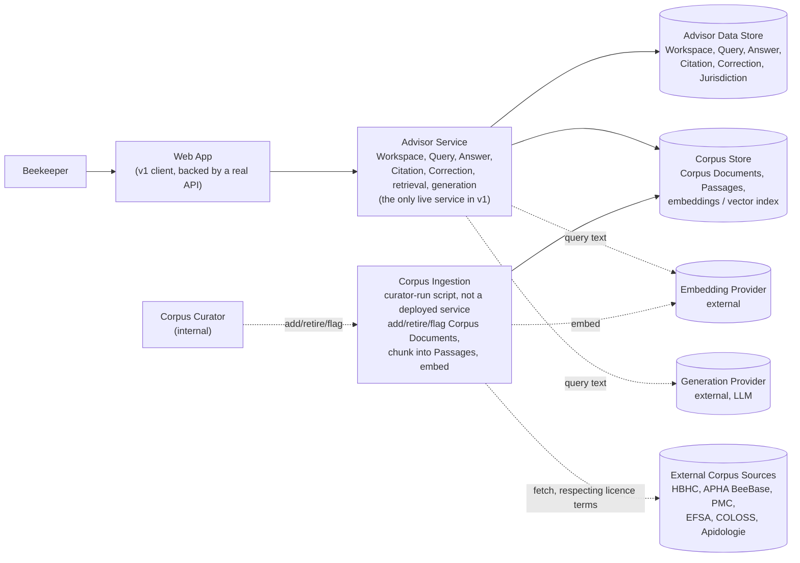

# System Context

This document shows the first HiveSight Advisor system boundary. It is intentionally higher level than a deployment diagram: it names the actors, applications, services, stores, and trust boundaries needed to support the v1 (Phase 1, Grounded Knowledge) architecture.

## Context

HiveSight Advisor is a grounded knowledge and decision-support product for beekeepers managing Varroa mite risk, architecturally independent of HiveSight (confirmed via grilling, `requirements/decision-log.md`). Version one answers Beekeeper Queries from a curated, multi-jurisdiction (US, UK) corpus of licensed source documents, with mandatory citation and explicit handling of stale or conflicting sources.

Unlike HiveSight, v1 has no asynchronous, long-running analysis job — retrieval and generation are both request/response operations. That removes one reason HiveSight split into two services (Core API plus a private async Analysis Service). Confirmed via grilling (see `requirements/decision-log.md`, Service Topology): v1 has exactly one live service, the Advisor Service behind the web app's API. Corpus Ingestion is a Corpus Curator-run script, not a deployed service — it writes into the same Corpus Store the Advisor Service reads from, but nothing keeps it running.

## Diagram

## Boundaries

### User And Client Boundary

The Client calls the Advisor Service directly; there is no gateway/edge layer decision made yet, unlike HiveSight's explicit API Gateway. User-facing operations require an authenticated User context and Workspace authorization, matching HiveSight's pattern (FR-000). Authentication depth is deferred the same way HiveSight's is — the domain shape assumes multiple users; v1 implementation does not.

Browser or chat clients must not depend on embedded long-lived secrets, matching HiveSight's principle. This matters here even though there is no image upload flow: an API key for the generation or embedding provider must never be shipped to a client.

### Product Boundary

The Advisor Service owns the Beekeeper-facing workflow:

- Workspace
- Workspace Membership
- Query
- Answer
- Citation
- Correction
- Jurisdiction

### Retrieval And Generation Boundary

Query text leaves the system boundary twice on every request: once to the embedding provider (to retrieve relevant Passages) and once to the generation provider (to produce the Answer text). This is a real trust boundary, not an implementation detail — a Beekeeper's Query may incidentally contain personal or apiary-location information, and it is being sent to a third party regardless of how benign the Query's content usually is. Both calls should be treated with the same seriousness HiveSight applies to photo data leaving its boundary, even though the sensitivity profile here is lower.

### Corpus Ingestion Boundary

Corpus Ingestion is a Corpus Curator-run script, not a live service (confirmed via grilling, Service Topology). It requires the same `corpus_curator` Internal Capability regardless of being a script rather than a service, exactly matching HiveSight's Internal Capability pattern — running it locally does not bypass the authorization concept, it just means there is no separate deployment to secure yet. Fetching from External Corpus Sources must respect each source's licence terms (NFR-003) — this is a licensing trust boundary as much as a technical one; the ingestion pipeline is not free to treat every publicly readable page as freely reusable.

### Storage Boundary

Two conceptually separate stores, matching HiveSight's habit of separating product data from evidence data even before it's decided whether they are physically separate databases:

- **Advisor Data Store**: Workspace-scoped product data — Query, Answer, Citation, Correction.
- **Corpus Store**: shared, Workspace-independent content — Corpus Document, Passage, and the vector index used for retrieval.

Corpus Documents and Passages are not Workspace-owned (see `architecture/domain-model.md`), so they do not carry the same per-tenant access-control requirements HiveSight's photo storage does — but licence terms still constrain redistribution regardless of who is asking.

## Open Architecture Questions

- ~~What is the primary Client surface for v1...~~ — resolved: web app, backed by a real API. See `requirements/decision-log.md`, V1 Application Surface.
- ~~Should the Advisor Service and Corpus Ingestion be separate deployable services...~~ — resolved: one live service, ingestion is a curator-run script. See `requirements/decision-log.md`, Service Topology.
- ~~Which embedding provider... which generation provider...~~ — resolved: Voyage AI for embeddings, Claude for generation. See `requirements/decision-log.md`, Generation And Embedding Providers.
- ~~Which database should back the Advisor Data Store and Corpus Store...~~ — resolved: one Postgres database with `pgvector`. See `requirements/decision-log.md`, Database Technology.
- ~~What deployment platform should host the first production-like environment?~~ — resolved: Fly.io, for both the Advisor Service and the Postgres/`pgvector` database. See `requirements/decision-log.md`, Deployment Platform.
- ~~Should Corpus Ingestion run on a schedule, on Corpus Curator demand, or both...~~ — resolved: on demand only. See `requirements/decision-log.md`, Ingestion Trigger.
