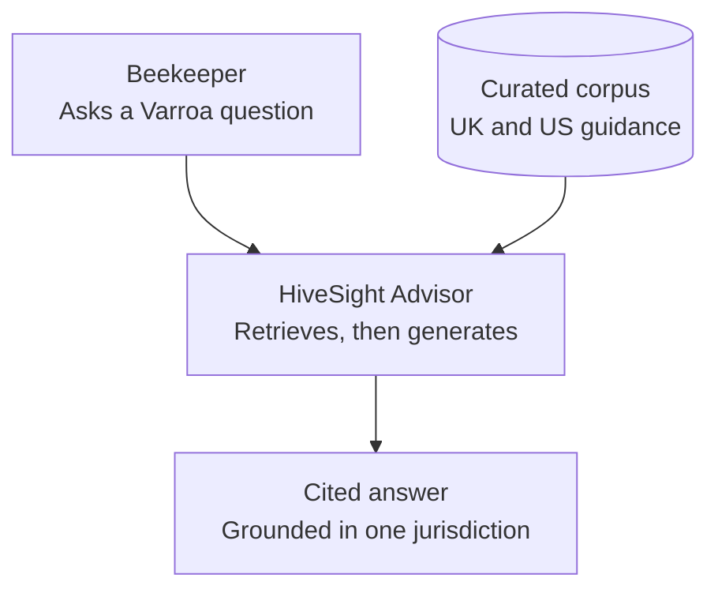

# Vision

**Status: grilled and confirmed for v1. See `requirements/decision-log.md` for the reasoning behind each confirmed scope decision.**

HiveSight Advisor is a grounded knowledge and decision-support product for beekeepers managing Varroa mite risk. It complements HiveSight's photo-based detection (visible bee and mite counting) with synthesized, cited guidance drawn from apicultural research, regulatory, and monitoring sources — and, in a later phase, the ability to propose concrete next actions for human approval rather than only answering questions.

The product is meant to stand on its own. It should be useful to a beekeeper who has never used HiveSight, and it should not require HiveSight data to function. Where HiveSight data is available, the Advisor may use it to sharpen its answers, but that is an enhancement, not a dependency.

The primary learning goal, alongside HiveSight's SDLC/predictive-AI focus, is to build a genuine generative-AI product — not a demo of retrieval-augmented generation, but something that earns its place by being useful on its own terms. A chatbot that answers questions correctly is not sufficient evidence of that; a beekeeper making a better-informed decision because of it is.

## How It Works Today (Slice 0001–0002)

The loop below is what a Beekeeper actually experiences right now, live: a question in, a cited answer out, never blended across jurisdictions.

Both jurisdictions are seeded today: UK guidance from APHA BeeBase, US guidance from the Honey Bee Health Coalition (HBHC). Selecting a Jurisdiction retrieves and cites only that Jurisdiction's source — the same question asked under each returns genuinely different, jurisdiction-appropriate guidance, not a reworded duplicate. See `architecture/vertical-slice-0001-grounded-query-answer-with-seeded-corpus.md` and `architecture/vertical-slice-0002-second-jurisdiction-and-non-blending-proof.md` for how this was built and proven.

## Product Direction

Two phases, sequenced deliberately rather than built at once:

**Phase 1 — Grounded Knowledge.** A retrieval-grounded assistant that answers beekeeper questions about Varroa monitoring and management from a curated, multi-jurisdiction corpus (US, UK, EU sources at minimum), with every claim traceable to a source passage. This phase proves the assistant is trustworthy before it is ever allowed to propose an action.

**Phase 2 — The Advisor.** Building on a working, trusted Phase 1, the system gains the ability to draft concrete next steps — a proposed treatment schedule, a record of what was applied and when — for explicit human approval. Phase 2 does not begin until Phase 1's grounding and citation behaviour is trusted enough to build on.

## Why This Matters As A Product, Not A Demo

- A beekeeper today has to manually reconcile guidance across multiple, sometimes conflicting, national and regional sources, written for different audiences at different levels of technical depth, with no single place that tells them which is current for their situation.
- Existing generative AI tools answer confidently regardless of whether they are grounded in anything current or regionally correct. Silently blending US, UK, and EU guidance into one answer would actively mislead a beekeeper about what treatments are legally available or currently recommended where they are.
- The Advisor is a genuine product opportunity precisely because getting this wrong is easy and costly, and getting it right requires real engineering discipline — jurisdiction-aware retrieval, source-freshness tracking, explicit conflict surfacing — not just a language model with a system prompt.

## Success Measures

- A beekeeper can ask a question in their own words and receive an answer grounded in current, cited sources, not an uncited generation.
- The system correctly distinguishes guidance by jurisdiction and does not blend sources across jurisdictions into a single unattributed answer.
- The system visibly flags when a source it would otherwise cite has been superseded or when authoritative sources disagree, rather than silently picking one.
- Once Phase 2 exists, every proposed action is clearly distinguished from grounded-knowledge output and requires explicit human approval before being treated as done.
- Requirements, design decisions, implementation, tests, and evaluation evidence can be traced through the project, the same discipline established on HiveSight.
